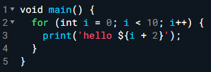
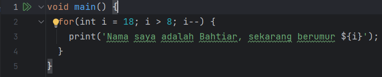
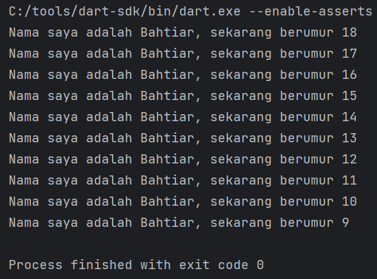

### BAHTIAR RIFA'I (2141720068) / 3F

---
## Tugas Praktikum

### Soal 1

Modifikasilah kode pada baris 3 di VS Code atau Editor Code favorit Anda berikut ini agar mendapatkan keluaran (output)
sesuai yang diminta!

Output yang diminta:

### Jawab:

Code:

Output:

### Soal 2

Mengapa sangat penting untuk memahami bahasa pemrograman Dart sebelum kita menggunakan framework Flutter ? Jelaskan!

### Jawab:

Memahami bahasa pemrograman Dart sebelum menggunakan framework Flutter sangat penting karena Dart adalah bahasa utama
dalam pengembangan aplikasi Flutter, dan pemahaman Dart memungkinkan untuk memahami konsep dasar pemrograman,
meningkatkan produktivitas, menghindari kesalahan umum atau penulisan code, dan menggunakan fungsi-fungsi Flutter dengan
lebih efektif.

### Soal 3

Rangkumlah materi dari codelab ini menjadi poin-poin penting yang dapat Anda gunakan untuk membantu proses pengembangan
aplikasi mobile menggunakan framework Flutter.

### Jawab:

Bahasa Dart adalah dasar utama di dalam Flutter. Dart dirancang untuk menggabungkan keunggulan bahasa pemrograman
tingkat tinggi dengan fitur modern, termasuk alat produktif, pengelolaan memori otomatis, anotasi tipe opsional, tipe
statis, dan portabilitas ke berbagai platform. Dalam pengembangan Flutter, pemahaman. Bahasa Dart dapat dieksekusi dalam dua cara: menggunakan Dart Virtual Machine (VM) atau dengan kompilasi menjadi
JavaScript. Dart juga mendukung fitur unggulan seperti hot reload yang mempercepat pengembangan aplikasi.

Dalam bahasa Dart, struktur dasarnya mirip dengan banyak bahasa pemrograman lainnya. Berikut adalah poin-poin
pentingnya:

1. Orientasi Objek: Dart adalah bahasa berorientasi objek, yang berarti Anda bekerja dengan objek yang memiliki data (
   fields) dan perilaku (methods). Objek-objek ini dibuat dari blueprint yang disebut class.
2. Operator Dart: Operator dalam Dart bekerja sebagai metode yang didefinisikan dalam class dengan sintaks khusus.
   Misalnya, operator == adalah metode untuk memeriksa kesetaraan.
3. Operator Aritmatika: Dart memiliki operator aritmatika standar seperti +, -, *, /, ~/ (untuk pembagian bulat),
   dan % (
   untuk sisa bagi).
4. Operator Increment dan Decrement: Dart mendukung operator penambahan (++) dan pengurangan (--) untuk menambah atau
   mengurangi nilai variabel sebesar 1.
5. Operator Persamaan dan Relasional: Dart memiliki operator == (untuk memeriksa kesetaraan) dan != (untuk memeriksa
   ketidaksetaraan). Untuk pengujian relasional, digunakan operator seperti >, <, >=, dan <=.
6. Operator Logika: Operator logika dalam Dart adalah ! (negasi), || (logika OR), dan && (logika AND), digunakan pada
   ekspresi boolean.

Dart memiliki fitur type safety yang memungkinkan operator == untuk memeriksa isi variabel, bukan alamat memori. Selain
itu, Dart tidak memerlukan operator === seperti yang ada pada JavaScript karena sudah memiliki fitur type safety yang
kuat.
Dengan pemahaman dasar ini, Anda dapat mulai mengeksplorasi dan menggunakan bahasa pemrograman Dart dalam pengembangan
aplikasi Flutter atau dalam konteks lainnya.