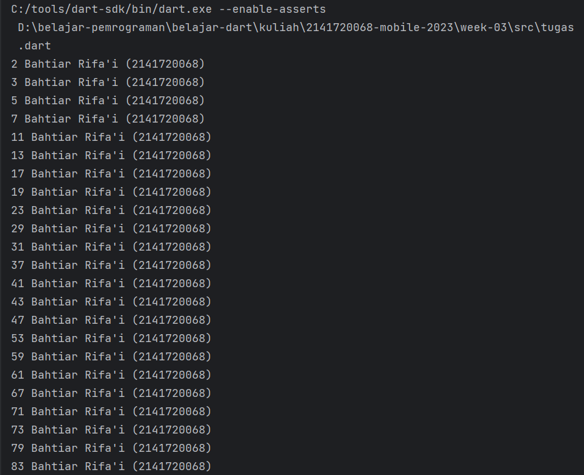

### BAHTIAR RIFA'I (2141720068) / 3F

---

## Praktikum 1: Menerapkan Control Flows ("if/else")

### Langkah 1

### Langkah 2

Error, karena kata kunci else if dalam Dart harus ditulis dalam huruf kecil, yaitu else if, bukan
Else If atau Else if. Kemudian, kata kunci else dalam Dart juga harus ditulis dalam huruf kecil, bukan Else. Berikut
kode yang benar:

### Langkah 3

Bahasa Dart tidak mendukung pengecekan string langsung dalam kondisi seperti itu. Perlu memeriksa apakah variable "test"
sama dengan nilai yang diharapkan. Di sini adalah kode yang benar:

---

## Praktikum 2: Menerapkan Perulangan "while" dan "do-while"

### Langkah 1

### Langkah 2

Error, karena belum mendefinisikan atau menginisialisasi variable counter. Berikut kode yang berar:

### Langkah 3

Error sama seperti langkah 2, belum mendefinisikan variable counter.

---

## Praktikum 3: Menerapkan Perulangan "for" dan "break-continue"

### Langkah 1

### Langkah 2

Error, variabel Index dan index tidak sama, dan dalam
perulangan for, perlu melakukan peningkatan pada variabel iterasi (index++). Berikut adalah kode yang diperbaiki:

### Langkah 3

Error, pernyataan if dan else if harus ditulis dalam huruf kecil (case-sensitive),

## Tugas Praktikum

Buatlah sebuah program yang dapat menampilkan bilangan prima dari angka 0 sampai 201 menggunakan Dart. Ketika bilangan
prima ditemukan, maka tampilkan nama lengkap dan NIM Anda.

Jawab:

Kode:

Hasil:

