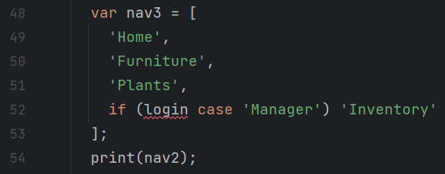
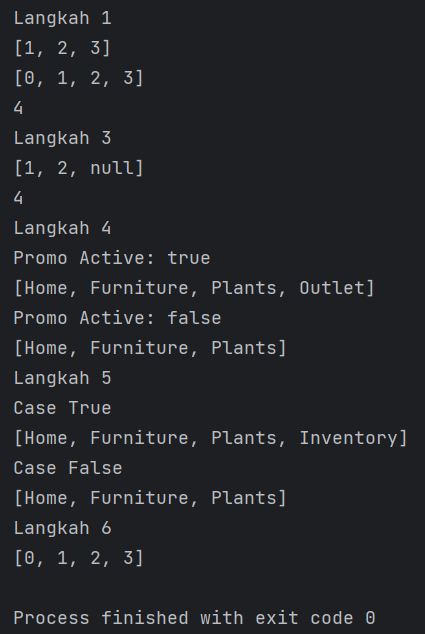

### BAHTIAR RIFA'I (2141720068) / 3F

---

## Praktikum 1: Eksperimen Tipe Data List

### Langkah 1

### Langkah 2

Kode pada langkah 1 yaitu membuat sebuah list dengan elemen [1, 2, 3], menguji panjang list dan nilai elemen ke-1,
mencetak panjang list dan nilai elemen ke-1, mengganti nilai elemen ke-1 menjadi 1, dan menguji kembali nilai elemen
ke-1 serta
mencetaknya.

### Langkah 3

Berikut kode yang sudah diperbaiki:

---

## Praktikum 2: Eksperimen Tipe Data Set

### Langkah 1

### Langkah 2

Kode tersebut merupakan contoh penggunaan Set dalam Dart untuk membuat sebuah set bernama halogens. Set adalah koleksi
yang mengandung elemen-elemen unik tanpa urutan tertentu.

### Langkah 3

Berikut kode yang sudah diperbaiki:

Hasil:

---

## Praktikum 3: Eksperimen Tipe Data Maps

### Langkah 1

### Langkah 2

Kode tersebut mengilustrasikan penggunaan Map dalam Dart, di mana Maps dapat mengasosiasikan value dengan key tertentu
dan kemudian mengakses values tersebut menggunakan key tersebut.

### Langkah 3

Berikut kode yang sudah diperbaiki:

Hasil:

---

## Praktikum 4: Eksperimen Tipe Data List: Spread dan Control-flow Operators

### Langkah 1

### Langkah 2

Kode tersebut adalah contoh penggunaan operator spread (...) dalam bahasa pemrograman Dart. Dimana
dalam inisialisasi list2, menggunakan operator spread (...) untuk menggabungkan elemen-elemen dari variabel list ke
dalam list2. Akibatnya, list2 akan berisi elemen-elemen [0, 1, 2, 3].

### Langkah 3

Berikut kode yang sudah diperbaiki:

### Langkah 4

Berikut kode yang sudah diperbaiki:

### Langkah 5

Berikut kode yang sudah diperbaiki:

### Langkah 6

Berikut adalah beberapa manfaat dari Collection For pada Dart:

- Kode yang lebih singkat
- Mengurangi kesalahan
- Mempermudah pemeliharaan kode

Hasil:

---

## Praktikum 5: Eksperimen Tipe Data Records

### Langkah 1

### Langkah 2

Dalam kode tersebut, kita membuat sebuah variabel bernama record yang bertipe Record. Records memungkinkan kita untuk
menyimpan beberapa objek dalam satu objek. Namun, berbeda dengan tipe data koleksi lainnya, Records memiliki ukuran
tetap, heterogen, dan berjenis data.

### Langkah 3

Berikut kode yang sudah diperbaiki:

### Langkah 4

Berikut kode yang sudah diperbaiki:

### Langkah 5

Berikut kode yang sudah diperbaiki:

Hasil:

---

## Tugas Praktikum

1. Jelaskan yang dimaksud Functions dalam bahasa Dart!

   Jawab:

   Function dalam bahasa Dart adalah blok kode program yang akan dijalankan saat dipanggil. Untuk membuat sebuah fungsi,
   kita menggunakan kata kunci void jika fungsi tersebut tidak mengembalikan nilai (void function), atau kita dapat
   menyebutkan tipe data yang akan dikembalikan jika fungsi mengembalikan nilai (return function), diikuti dengan nama
   fungsi, kurung () yang dapat berisi parameter, dan diakhiri dengan blok kode {}.

2. Jelaskan jenis-jenis parameter di Functions beserta contoh sintaksnya!

   Jawab:

    - Optional Parameter

      Secara default, parameter wajib harus dikirimkan saat kita memanggil fungsi. Namun, jika kita ingin membuat
      parameter menjadi opsional, yang berarti tidak wajib dikirimkan, kita dapat mengelompokkannya dalam tanda
      kurung kotak []. Parameter opsional harus memiliki tipe data nullable 'TipeData?'. Penting untuk diingat bahwa
      parameter-parameter opsional harus ditempatkan di belakang parameter-parameter yang tidak dapat bernilai null 
      (non-nullable) dalam daftar parameter fungsi.
   
      Contoh kode:

         

    - Default Value Parameter

      Jika optional parameter tidak ingin nullable, Kita dapat memberikan nilai default
      untuk parameter tersebut. Cara melakukannya adalah dengan menambahkan nilai default setelah nama parameter,
      seperti ini:
      
      Contoh kode:      

         

    - Named Parameter

      Dart memiliki fitur "named parameter" yang memungkinkan pengguna untuk memberi nama parameter saat memanggil
      fungsi, sehingga tidak perlu mengikuti urutan posisi parameter tersebut. Dalam mendefinisikan fungsi, named
      parameter dikelompokkan dalam kurung kurawal {}. Secara default, parameter bernama adalah nullable, sehingga kita
      dapat menambahkan karakter '?' setelah tipe data, dan jika kita ingin membuatnya non-nullable, kita dapat
      menambahkan 'required' sebelum tipe data. Fitur ini meningkatkan fleksibilitas dalam pemanggilan fungsi dan 
      membuat kode lebih jelas.

      Contoh kode:

         

3. Jelaskan maksud Functions sebagai first-class objects beserta contoh sintaknya!

   Jawab:

   “Functions as first-class objects” dalam bahasa pemrograman Dart adalah berarti fungsi ini dapat diperlakukan seperti
   objek lainnya. Kita dapat menyimpannya dalam sebuah variabel, memasukkannya sebagai parameter ke fungsi lain, dan
   mengembalikannya dari fungsi lain.

   Contoh kode:

   

4. Apa itu Anonymous Functions? Jelaskan dan berikan contohnya!

   Jawab:

   Dalam Dart, Kita dapat membuat fungsi tanpa nama yang disebut anonymous function, lambda, atau closure. Anonymous
   function biasanya digunakan untuk operasi sekali pakai jika kita tidak menyimpannya kedalam sebuah variable ,dan
   sering digunakan untuk tugas-tugas sederhana atau sebagai argumen untuk fungsi lain.

   Contoh kode:

   

5. Jelaskan perbedaan Lexical scope dan Lexical closures! Berikan contohnya!

   Jawab:

    - Lexical Scope

      Lexical scope berkaitan dengan cakupan variabel dalam kode di mana variabel tersebut dideklarasikan dan dapat
      diakses oleh kode dalam kurung kurawal yang mengelilinginya.

      Contoh kode:

      

    - Lexical Closures

      Lexical closure adalah kemampuan sebuah fungsi untuk mengakses variabel dalam cakupan leksikal (tempat fungsi
      tersebut didefinisikan), bahkan ketika fungsi tersebut digunakan di luar cakupan tersebut.

      Contoh kode:

      

6. Jelaskan dengan contoh cara membuat return multiple value di Functions!

   Jawab:

   Dalam Dart, Kita tidak dapat mengembalikan multiple values secara langsung dari sebuah fungsi seperti Python. Namun,
   Kita dapat menggunakan beberapa pendekatan untuk mengembalikan multiple values dari sebuah fungsi. Salah satu
   pendekatan umum adalah menggunakan Map atau List untuk mengelompokkan multiple values tersebut.

   Contoh kode:

   