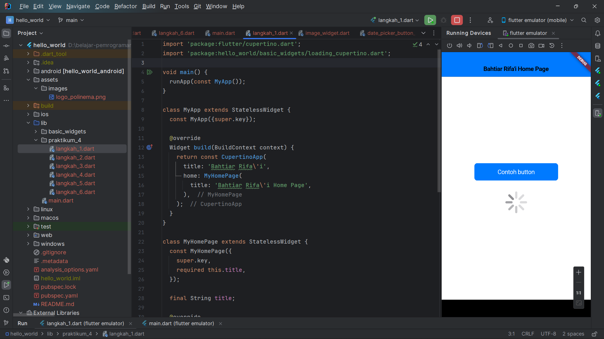
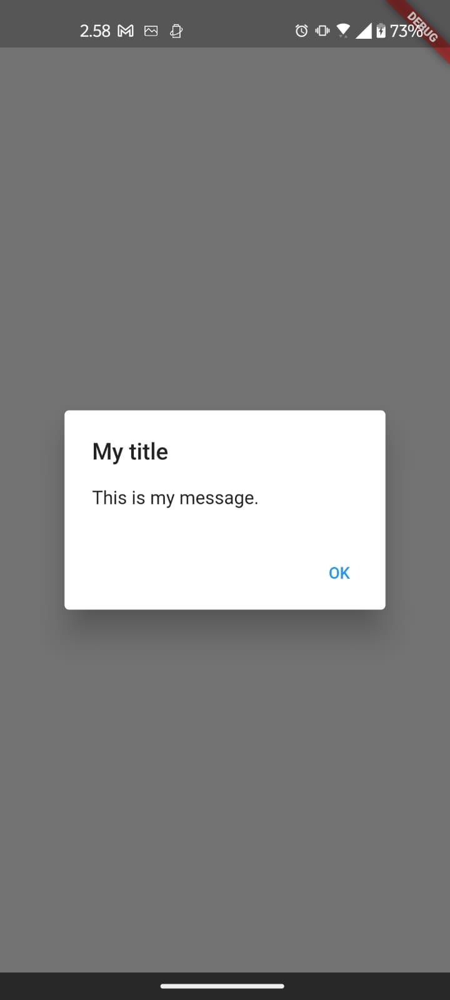

# BAHTIAR RIFA'I (2141720068) / 3F

---

## Praktikum 3: Menerapkan Widget Dasar

### Hasil di Emulator

### Hasil di HP (Asus Zenfone 9)

---

## Praktikum 4: Menerapkan Widget Material Design dan iOS Cupertino

### Langkah 1: Cupertino Button dan Loading Bar

#### Hasil di Emulator

#### Hasil di HP (Asus Zenfone 9)

### Langkah 2: Floating Action Button (FAB)

#### Hasil di Emulator

#### Hasil di HP (Asus Zenfone 9)

### Langkah 3: Scaffold Widget

#### Hasil di Emulator

#### Hasil di HP (Asus Zenfone 9)

### Langkah 4: Dialog Widget

#### Hasil di Emulator

#### Hasil di HP (Asus Zenfone 9)

### Langkah 5: Input dan Selection Widget

#### Hasil di Emulator

#### Hasil di HP (Asus Zenfone 9)

### Langkah 6: Date and Time Pickers

#### Hasil di Emulator

#### Hasil di HP (Asus Zenfone 9)

---

## Your first Flutter app

### Hasil di Emulator

### Hasil di HP (Asus Zenfone 9)

