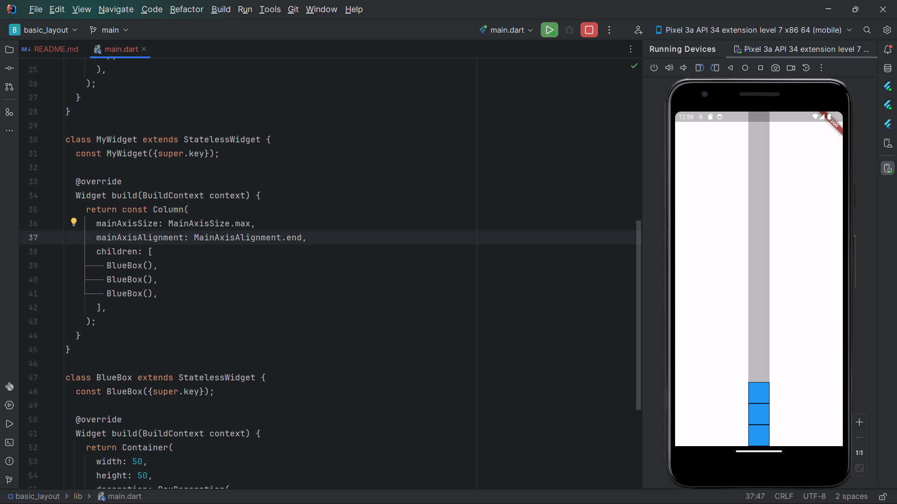
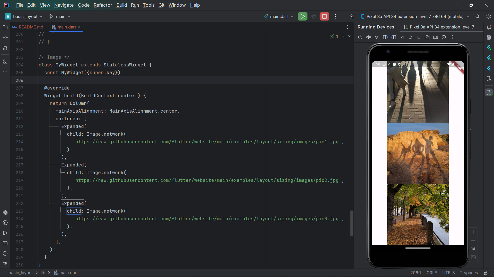

# BAHTIAR RIFA'I (2141720068) / 3F

---

## Praktikum 1: Membangun Layout di Flutter

---

## Praktikum 2: Implementasi button row

---

## Praktikum 3: Implementasi text section

---

## Basic Layout

### Row and Column

| Row                                          |                       Column                       |
|----------------------------------------------|:--------------------------------------------------:|
|  |  |

### Axis size and alignment

#### mainAxisSize

| mainAxisSize.max                                                      |                           mainAxisSize.min                            |
|-----------------------------------------------------------------------|:---------------------------------------------------------------------:|
|  |  |

#### mainAxisAlignment

| mainAxisAlignment.start                                                           |                     mainAxisAlignment.end                      |
|-----------------------------------------------------------------------------------|:--------------------------------------------------------------:|
|  |  |

#### crossAxisAlignment

### Flexible widget

| Flexible.Tight                                                     |                           Flexible.Loose                           |
|--------------------------------------------------------------------|:------------------------------------------------------------------:|
|  |  |

### Expanded widget

### SizedBox widget

### Spacer widget

### Text widget

### Icon widget

### Image widget

### Putting it all together

