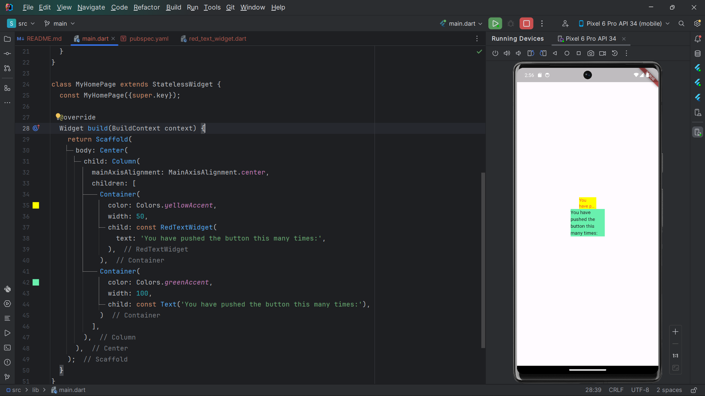

# BAHTIAR RIFA'I (2141720068) / 3F

---

## Hasil Praktikum

---

## Penjelasan Langkah 2: Menambahkan Plugin

Perintah flutter pub add auto_size_text digunakan untuk menambahkan paket auto_size_text ke proyek Flutter. Paket ini
menyediakan widget yang dapat menyesuaikan ukuran teks secara otomatis berdasarkan ukuran layar perangkat. Ini
sangat berguna untuk membuat aplikasi yang responsif.

---

## Penjelasan Langkah 5: Buat Variabel text dan parameter di constructor

Kode tersebut adalah definisi sebuah widget dalam Flutter yang disebut RedTextWidget. Widget ini menerima parameter text
yang harus diisi saat membuat instance widget, dan akan menampilkan teks dengan warna merah. Kunci (key) widget juga
dapat disediakan sebagai parameter opsional.

---

## Penjelasan Tiap Parameter pada 'auto_size_text'

| Parameter           | Deskripsi                                                                                                                 |
|---------------------|---------------------------------------------------------------------------------------------------------------------------|
| key                 | Mengontrol bagaimana satu widget menggantikan widget lain di pohon.                                                       |
| textKey             | Menetapkan kunci untuk widget Text yang dihasilkan.                                                                       |
| style               | Jika tidak null, gaya ini akan digunakan untuk teks.                                                                      |
| minFontSize         | Batas ukuran font terkecil yang digunakan saat menyesuaikan ukuran teks.                                                  |
| maxFontSize         | Batas ukuran font terbesar yang digunakan saat menyesuaikan ukuran teks.                                                  |
| stepGranularity     | Ukuran langkah dalam penyesuaian ukuran font ke batasan.                                                                  |
| presetFontSizes     | Mendefinisikan semua ukuran font yang mungkin. Penting: presetFontSizes harus dalam urutan menurun.                       |
| group               | Menyinkronkan ukuran beberapa widget AutoSizeText.                                                                        |
| textAlign           | Bagaimana teks harus ditempatkan secara horizontal.                                                                       |
| textDirection       | Arah dari teks. Ini menentukan bagaimana nilai textAlign seperti TextAlign.start dan TextAlign.end ditafsirkan.           |
| locale              | Digunakan untuk memilih font ketika karakter Unicode yang sama dapat ditampilkan secara berbeda, tergantung pada locale.  |
| softWrap            | Apakah teks harus putus pada soft line breaks.                                                                            |
| wrapWords           | Apakah kata-kata yang tidak muat dalam satu baris harus dibungkus. Defaultnya adalah true untuk berperilaku seperti Text. |
| overflow            | Bagaimana overflow visual harus ditangani.                                                                                |
| overflowReplacement | Jika teks meluap dan tidak muat dalam batasannya, widget ini akan ditampilkan sebagai pengganti.                          |
| textScaleFactor     | Jumlah piksel font untuk setiap piksel logis. Juga mempengaruhi minFontSize, maxFontSize dan presetFontSizes.             |
| maxLines            | Jumlah maksimum baris opsional untuk rentang teks.                                                                        |
| semanticsLabel      | Label semantik alternatif untuk teks ini.                                                                                 |