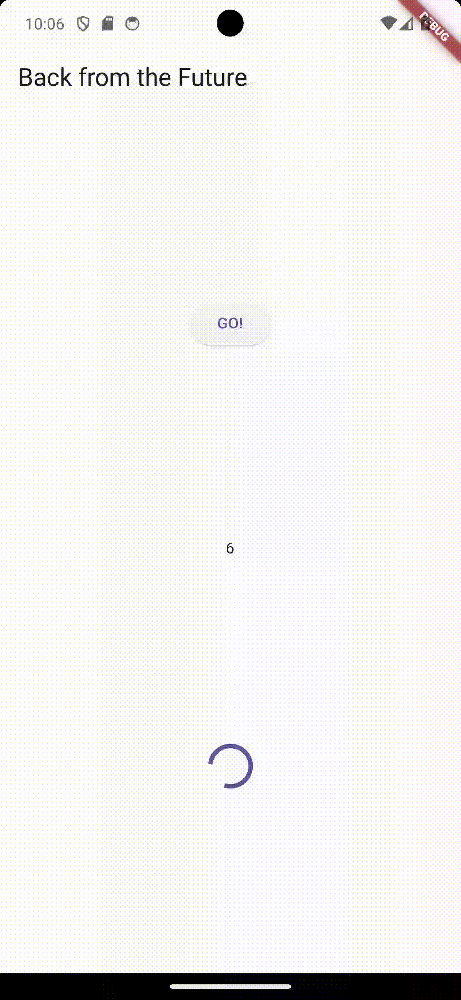

# BAHTIAR RIFA'I (2141720068) / 3F

---

## Soal 2

---

## Soal 3

Maksud dari substring dan catchError dalam adalah:

- **Substring**: Mengambil beberapa karakter dari suatu string, berdasarkan posisi dan panjang tertentu. `substring(0, 450)` dalam kode tersebut mengambil huruf dari indeks 0 hingga 450. Jadi, result akan berisi 450 karakter pertama dari body hasil.
- **catchError**: Fungsi ini dipanggil jika terjadi error saat menjalankan Future. `result = 'An error occurred'` dalam kode tersebut jika terjadi error, result diatur ke 'An error occurred'.

 

---

## Soal 4

- **Langkah 1**: Kode tersebut berisi tiga fungsi Future<int>: returnOneAsync, returnTwoAsync, dan returnThreeAsync. Masing-masing fungsi ini akan menunda eksekusi selama tiga detik (await Future.delayed(const Duration(seconds: 3))), lalu mengembalikan nilai integer: 1, 2, dan 3 secara berurutan.

- **Langkah 2**: Kode tersebut mendefinisikan fungsi Future bernama count. Fungsi count mendeklarasikan variabel total dan menginisialisasikannya dengan nilai 0. Selanjutnya, fungsi returnOneAsync dipanggil dan program menunggu sampai fungsi ini selesai (ini membutuhkan waktu sekitar 3 detik). Nilai yang dikembalikan (yaitu 1) kemudian ditambahkan ke total. Proses yang sama diulangi untuk returnTwoAsync dan returnThreeAsync, dengan masing-masing menambah 2 dan 3 ke total. Terakhir, setState dipanggil untuk memperbarui nilai result dengan total penjumlahan (yang seharusnya menjadi 6).

 
